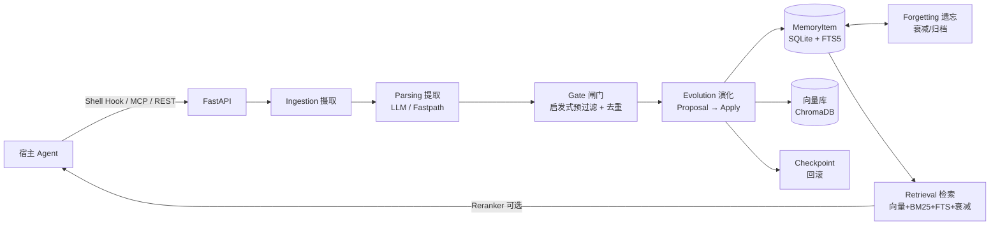

# Remembrance-System

**AI Agent 长期记忆管理系统** —— 摄取、闸门、演化、遗忘、检索的完整闭环。

面向 Agent 的长期记忆基础设施：把散落的消息、文档、对话沉淀为可检索、可演化、可遗忘的结构化记忆，并通过 Shell Hook / MCP / REST API 三种形态接入任意宿主 Agent。

> 测试状态：**120/120 全绿** · 技术栈：Python 3.11+ / FastAPI / SQLModel / SQLite / ChromaDB

---

## ✨ 核心特性

| 能力 | 说明 |
|------|------|
| **闭环记忆管线** | `Source → RawDocument → Candidate → Gate → Proposal → Apply → MemoryItem → Feedback → Forgetting → Rollback`，全链路可观测 |
| **四路融合检索** | 向量语义（bge-m3/ChromaDB）+ jieba BM25 词级 + **FTS5 trigram 子串容错** + 时效衰减，并支持 Reranker 精排（ADR-0008） |
| **启发式相关性闸门** | 借鉴 aiduMEM：纠错/社交结束语/追问热缓存/自我指代/明确回忆/上下文延续/实质内容 七级规则，15s 热缓存 |
| **三态去重** | candidate 创建前做余弦相似度判定：`merge / update / insert`，阈值 0.80 / 0.65 可配 |
| **Tidal Coalescing 潮波并忆** | 短消息按 `user_id + lane` 缓冲合并，减少 LLM 提取调用（默认关闭，可开关） |
| **Fastpath 白名单直写** | 自我声明/偏好表达/显式指令三类句型绕过 LLM 直接写入，宁 miss 不脏写 |
| **遗忘与归档** | Ebbinghaus 指数衰减，decay 低于阈值自动转 archived；归档不参与检索、物理不删 |
| **Checkpoint 回滚** | 记忆每次变更生成快照，支持一键回滚到上一版本 |
| **CoreMemory** | `identity / task / policy` 三块持久化，支持多 namespace 隔离 |
| **Lane 分轨** | `fact / rule / experience / preference / chat / general` 六轨独立衰减参数与检索权重 |
| **双形态集成** | **Shell Hook**（零依赖 CLI 注入，2s 硬超时）+ **MCP server**（标准 JSON-RPC 2.0，search/add/feedback 三工具） |
| **安全加固** | 默认回环绑定 + 非回环强制 API_KEY（恒时比较）、SSRF 防护、备份恢复原子换入、API 端点域名白名单 |

---

## 🏗️ 系统架构



```
remembrance/
├── core/        settings · auth · scheduler · ids · time
├── ingestion/   arxiv/rss 适配器 · coalesce 缓冲 · SSRF 安全抓取
├── parsing/     LLM 提取器 · fastpath 白名单
├── gate/        启发式预过滤 · 余弦去重 · 矛盾检测 · 决策
├── evolution/   proposer · promoter · reflector · rollback
├── retrieval/   hybrid 四路融合 · intent 分类 · reranker
├── memory/      forgetting 遗忘
├── models/      SQLModel 表 · Pydantic schema · 枚举
├── services/    业务逻辑层（ADR-0001 门面铁律）
├── storage/     db · FTS5 · edges · vector_store
└── api/         路由（薄 handler，逻辑下沉 service）
```

---

## 🚀 快速开始

```bash
# 1. 克隆
git clone https://github.com/JIUSHIQINGSHAN/Remembrance-System.git
cd Remembrance-System

# 2. 环境
python -m venv .venv
.venv\Scripts\activate          # Windows
# source .venv/bin/activate     # Linux/macOS
pip install -e .

# 3. 配置（复制模板后填入密钥）
cp .env.example .env
#    OPENAI_API_KEY=sk-xxx            # LLM + Embedding（必填）
#    API_KEY=your-admin-key           # API 鉴权（非回环部署必填）
#    RERANKER_API_KEY=sk-xxx          # 可选，独立精排密钥

# 4. 初始化数据库并启动
python scripts/init_db.py
python api_server.py                 # 默认 http://127.0.0.1:8767
```

Docker 部署：

```bash
docker build -t remembrance:0.3.6 .
docker run -d -p 8767:8767 \
  -e API_KEY=your-admin-key \
  -e OPENAI_API_KEY=sk-xxx \
  -v /your/data:/data \
  remembrance:0.3.6
```

> 容器内默认 `HOST=0.0.0.0`，**必须注入 `API_KEY`**，否则启动守卫拒绝运行（安全设计）。

---

## ⚙️ 主要配置

| 环境变量 | 默认值 | 说明 |
|----------|--------|------|
| `HOST` / `PORT` | `127.0.0.1` / `8767` | 监听地址；非回环地址必须配置 API_KEY |
| `API_KEY` | 空 | REST API 鉴权（恒时比较） |
| `OPENAI_API_KEY` | 空 | LLM 提取 + Embedding（bge-m3） |
| `OPENAI_BASE_URL` / `LLM_MODEL` | openai / gpt-4o-mini | 兼容 OpenAI 协议的服务（如 SiliconFlow） |
| `EMBED_MODEL` | `BAAI/bge-m3` | Embedding 模型 |
| `RERANKER_ENABLED` | `true` | 是否启用精排（失败自动降级） |
| `COALESCE_ENABLED` | `false` | 潮波并忆缓冲开关 |
| `DEDUP_MERGE/UPDATE_THRESHOLD` | `0.80` / `0.65` | 三态去重阈值 |
| `REMEMBRANCE_HOME` | 仓库根 | 数据目录（DB/向量库/备份） |
| `GATE_CACHE_TTL` | `15.0` | 闸门热缓存秒数 |
| `ALLOWED_API_HOSTS` | openai / siliconflow | LLM/精排端点域名白名单 |

完整配置见 `remembrance/core/settings.py`。

---

## 🔌 API 摘要（`API_KEY` 为空时全部公开；非空时除 `/health` 外均需 `X-API-Key` 头）

| 方法 | 路径 | 说明 |
|------|------|------|
| POST | `/add` | 写入记忆（自动走 fastpath / coalesce / 去重） |
| POST | `/search?trace=true` | 混合检索，可返回逐步诊断 |
| POST | `/gate` | 对候选执行闸门决策 |
| GET/POST | `/candidates` `/proposals` | 候选/提案列表，提案可 approve/reject |
| POST | `/proposals/{id}/decide` | 决策提案 |
| POST | `/memory/{id}/rollback` | 回滚记忆 |
| POST | `/feedback` | 记忆反馈（有用性/幻觉风险） |
| POST | `/evolve/run` `/ingest/run` | 手动触发演化/摄取 worker |
| GET/PUT | `/core-memory` | CoreMemory 读写 |
| GET/POST | `/sources` | 摄取源管理 |
| GET/POST/DELETE | `/edges...` | 记忆关系与 supersedes 链 |
| GET | `/checkpoint` | 检查点列表 |
| GET | `/health` `/health/deep` `/stats` | 健康检查与统计 |

## 🔌 集成形态

**Shell Hook**（读，零依赖）：

```bash
echo '{"query":"记得之前讨论的检索方案吗"}' | python scripts/shell_hook.py
# → {"context":"- [0.82] 混合检索：向量 + BM25 + FTS5 ..."}
```

**MCP**（写，标准协议）：

```bash
echo '{"jsonrpc":"2.0","id":1,"method":"initialize","params":{}}' | python scripts/mcp_server.py
```

运维脚本：`backup.py`（一致性快照+manifest）/ `restore.py`（原子恢复+停服保护）/ `upgrade_check.py`（升级前检查）/ `perf_baseline.py`（性能基线）。

---

## ✅ 测试

```bash
.venv\Scripts\python.exe -m pytest tests/ -q
# 120 passed —— 全绿
```

测试覆盖：设置/鉴权/闸门/去重/合并缓冲/FTS/检索融合/Shell Hook 超时/MCP 协议/SSRF/备份恢复/端到端。

---

## 📚 文档索引

- `CONTEXT.md` — 领域词汇表（lane / gate / coalesce / fastpath / checkpoint…）
- `docs/adr/` — 架构决策记录（0001-0008：门面铁律、零硬编码、coalesce 缓冲键、基础设施栈、遗忘语义、Shell Hook 契约、集成形态、FTS5 并列接入）
- `docs/plans/` — 各版本执行方案
- `docs/aidumem-port-results.md` — aiduMEM 移植结果与审计修复记录
- `AGENTS.md` — Agent 协作约定（issue tracker / 测试纪律）

---

## 🛠️ 技术栈

FastAPI · SQLModel · SQLite（+FTS5 trigram）· ChromaDB（cosine）· jieba BM25 · APScheduler · Pydantic v2 · httpx · rank-bm25 · tenacity · OpenAI SDK

## 📜 许可

未指定（个人项目）。如有需要请在 Issues 中讨论。
