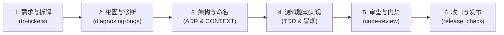

# 兰台记忆标准化开发工作流规范（SOP）

> 适用范围：兰台项目的所有新功能开发、缺陷修复、算法演化与发布管理。
> 核心原则：**规范驱动、测试先导、留痕审计、宁 miss 不脏写、发布人工闸门**。

---

## 阶段概览

---

## 阶段 1：需求拆解与分诊（to-tickets / 本地 Issue 管理）

1. **规范目录**：每个特性/议题在 `.scratch/<feature-slug>/` 建立独立目录。
   - 规格书：`.scratch/<feature-slug>/spec.md`
   - 子票据：`.scratch/<feature-slug>/issues/<NN>-<slug>.md`（从 `01` 递增编号，一人一票或一事一票）。
2. **垂直切片（Vertical Slice）原则**：
   - 严禁纯横向拆分（如「写全部 DB 表 → 写全部 API → 写全部前端」）。
   - 必须以最小可交付、可独立验证的端到端切片立票。
3. **标准分诊标签（Triage Labels）**：
   - `needs-triage`：待维护者/架构师评审。
   - `needs-info`：缺少必要上下文，需补充信息。
   - `ready-for-agent`：规格详尽，Agent 可独立执行。
   - `ready-for-human`：涉及高敏决策或物理环境，需人工介入。
   - `wontfix`：明确不予实现。

---

## 阶段 2：系统性根因诊断（diagnosing-bugs）

当遇到缺陷、测试失败或指标异动时，严禁猜想式盲修，必须严格执行 **5 步诊断循环**：

1. **确定性复现（Reproduce）**：
   - 用最小输入、单测或脚本稳定复现失败，保留完整报错日志与调用栈。
2. **单一假设提出（Formulate Single Hypothesis）**：
   - 基于调用栈提出唯一假设（例如："假设 `hybrid.py` 的第 139 行 `embed()` 在外部 API 401 时抛异常未被捕获，导致中断"）。
3. **隔离求证（Isolate & Prove）**：
   - 编写探针脚本或断言求证假设真伪，严禁在未求证前修改业务逻辑。
4. **最小根因修复（Apply Minimal Root-Cause Fix）**：
   - 针对根因精准修复，杜绝使用空 `try/catch` 吞异常或临时屏蔽断言。
5. **验证与回归（Verify & Regression）**：
   - 运行针对该缺陷的专门测试，并复跑全量测试套件确保零回归。
- **留痕要求**：诊断报告按 `docs/memory-quality/<slug>-diagnosis-YYYY-MM-DD.md` 归档。

---

## 阶段 3：架构与领域治理（ADR & 传统意象命名）

1. **架构决策留痕（ADR）**：
   - 凡涉及对外 API 契约、底层存储 Schema、检索打分算法、安全策略或降级逻辑变更，必须在 `docs/adr/<NNNN>-<slug>.md` 撰写 ADR。
2. **传统意象命名纪律（ADR-0013 / AGENTS.md）**：
   - 正式中文名必须为 2–4 字、出自官职/典籍/器物/成语传统意象、名实相副。
   - **必须先在 `CONTEXT.md` 词汇表登记**出处、英文代号与功能含义，未登记前严禁在代码与文档中使用。
3. **数据纪律**：
   - 贯彻「宁 miss 不脏写」：低置信度候选进待审队列或直接标记 rejected；拿不准的判定进人工闸门，绝不静默篡改历史数据。

---

## 阶段 4：测试驱动实现（TDD & 测试纪律）

1. **Red-Green-Refactor 循环**：
   - **Red**：先编写针对新特性/新修复的测试用例，运行并确认其失败（预期内失败）。
   - **Green**：编写满足测试的最小生产代码，运行确认用例通过。
   - **Refactor**：在测试保护网下优化代码结构、命名与模块设计。
2. **核心函数冒烟铁律（AGENTS.md）**：
   - **每个被路由、worker、service 调用的核心函数，必须有至少一个真实构造输入、内部逻辑不 mock 的冒烟测试**。
   - mock 仅允许用于外部不可控依赖（外部网络 LLM / Embedding / Rerank API、硬件与外部文件系统），**严禁 mock 掉被测函数内部的任何分支与计算逻辑**。
3. **环境与运行纪律**：
   - 使用受控虚拟环境（如 `.venv-verify`），运行测试必须显式注入 `PYTHONPATH=.`，避免模块加载漂移。

---

## 阶段 5：代码审查与回归门禁（code-review）

在任何功能合并前，对照五大审查支柱自检：

1. **正确性与容错（Correctness & Error Handling）**：
   - 外部数据空值防御、网络超时防御、多级平滑降级（如向量失败回退 FTS+BM25）。
2. **架构与契约（Architecture & Design）**：
   - 单一职责、参数与返回值类型注解完整、无重复抽象。
3. **安全性（Safety & Security）**：
   - 严禁在代码中硬编码 Secret、防注入、无越界 I/O。
4. **性能（Performance & Efficiency）**：
   - 避免循环内冗余 DB 查询、大内存常驻防护。
5. **门禁命令（全部通过才允许合并）**：
   - 全量单测：`$env:PYTHONPATH="."; python -m pytest tests/ -q`（0 failed）
   - 遗忘质量：`$env:PYTHONPATH="."; python scripts/run_forgetting_quality.py --check`（PASS）

---

## 阶段 6：版本发布与审计（release-process）

遵循 `docs/release-process.md`：

1. **一致性核对**：`scripts/release_check.py vX.Y.Z` 核对 `pyproject.toml`、`README.md`、`api_server.py`、`scripts/mcp_server.py` 与 `CHANGELOG.md`。
2. **版本代号**：在 CHANGELOG 与 `CONTEXT.md` 登记版本典籍代号。
3. **人工闸门**：代码提交与 tag 打标由 Agent 准备，`git push origin master --tags` 必须由人类维护者显式授权或手动执行。
