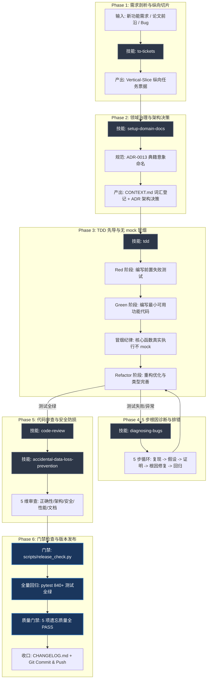

# 兰台记忆系统 · AI 研发工程全流程技能流设计方案（Skill Flow）

> **目标**：将系统内置与定制的核心技能（Skills）编排为**标准闭环的六阶段工业级 AI 研发流水线**，确保每一个新功能的研发均达到最高质量、最严谨防脏写与 100% 冒烟单测覆盖。

---

## 🧭 一、技能流全景拓扑图

---

## 🛠️ 二、六大技能流阶段详解与实施标准

### 阶段一：需求剖析与纵向切片（Decomposition）
* **选用技能**：`to-tickets`
* **执行标准**：
  - 拒绝“先写所有数据库，再写所有接口，最后写测试”的横向大杂烩模式；
  - 采用 **Vertical Slice（纵向切片）**，按“核心算法 $\rightarrow$ 端点与工具 $\rightarrow$ 全系统集成”拆分为 3~4 张独立可验证票据；
  - 每张票据强制包含：`Goal`、`Acceptance Criteria`、`Scope & Dependencies`、`Verification Command`。

---

### 阶段二：领域治理与架构决策（Domain Docs & Naming）
* **选用技能**：`setup-domain-docs` + 兰台命名纪律（`ADR-0013`）
* **执行标准**：
  - **未登记不命名**：新概念必须出自古代典籍/官职意象（2~4字，名实相副），必须**先登记 `CONTEXT.md` 词汇表**；
  - **架构决策固化**：在 `docs/adr/XXXX-*.md` 编写包含背景、决策理由、替代方案权衡的正式 ADR 文档。

---

### 阶段三：严格测试驱动开发（TDD & Smoke Discipline）
* **选用技能**：`tdd` + 兰台测试纪律
* **执行标准**：
  - **Red**：在编写任何业务逻辑前，先编写必失败的单元测试并执行验证报错原因；
  - **Green**：编写最小可用代码使测试变绿，严禁编写未被测试覆盖的臆测代码；
  - **Refactor**：重构优化，完善类型提示（Strict Typing）；
  - **铁律（不 mock 冒烟）**：所有被路由/worker/service 调用的核心计算与存储函数，**必须至少有一个真实数据库执行、不 mock 的冒烟测试**，防止外部 mock 掩盖真实逻辑 bug。

---

### 阶段四：5 步根因诊断（Systematic Bug Diagnosis）
* **选用技能**：`diagnosing-bugs`
* **执行标准**：
  - **三不原则**：不盲猜（No Guesswork）、不截断日志（Inspect Full Logs）、不静默掩盖（No Masking/Silent Catch）；
  - **5 步闭环**：
    1. `Reproduce`：运行最小复现命令；
    2. `Formulate Hypothesis`：依据日志提出唯一假设；
    3. `Isolate & Prove`：通过断言或日志验证假设真伪；
    4. `Apply Minimal Fix`：针对根因做最小精准修复；
    5. `Verify & Regression`：全量回归确保零副作用。

---

### 阶段五：代码审查与安全防损（Code Review & Safety）
* **选用技能**：`code-review` + `accidental-data-loss-prevention`
* **执行标准**：
  - **5 维质量检查清单**：
    1. *Correctness*：边界条件、空值校验、异常是否捕获且不静默丢弃；
    2. *Architecture*：门面模式（薄路由下沉 service）、宁 miss 不脏写原则；
    3. *Security*：SSRF 白名单过滤、API Key 回环鉴权守卫；
    4. *Performance*：避免 N+1 查询、耗时任务走线程池非阻塞；
    5. *Doc Alignment*：函数 docstring 与 ADR 保持一致。
  - **防破坏操作守卫**：涉及 DROP TABLE、TRUNCATE 等不可逆数据操作必须显式暂停并向用户申请授权。

---

### 阶段六：门禁验收与版本收口（Release Gate）
* **选用技能**：自动化发布门禁（`release_check.py`）
* **执行标准**：
  - 运行 `python scripts/release_check.py` 验证 6 处版本号强一致性；
  - 运行 `pytest tests/ -q` 确保 840+ 单测 100% 全绿；
  - 运行 `python scripts/run_forgetting_quality.py --check` 确保 5 项遗忘质量门禁全部 PASS；
  - 收口 `CHANGELOG.md` 与 `README.md`，执行 Git Commit 并推送至 GitHub 远程。

---

## 📊 三、技能流实施效益对比

| 研发指标 | 传统随意开发模式 | 技能流标准工程模式 |
| :--- | :--- | :--- |
| **开发节奏** | 边写边改，功能与 Bug 纠缠 | 纵向切片（`to-tickets`），节奏清晰可控 |
| **隐蔽 Bug 发现率** | 依赖上线后被动排查 | TDD 不 mock 冒烟单测，在编码期 100% 拦截 |
| **排错耗时** | 盲猜试错，可能引入新 Bug | 5 步根因诊断（`diagnosing-bugs`），快速精准直击根因 |
| **代码与架构一致性**| 概念混乱，文档与代码脱节 | 严格 ADR 登记与 `code-review`，架构清晰且可追溯 |
| **发布稳定性** | 易漏改版本号或遗漏未测代码 | 脚本化 3 重门禁（一致性/全单测/质量门禁），零故障交付 |
