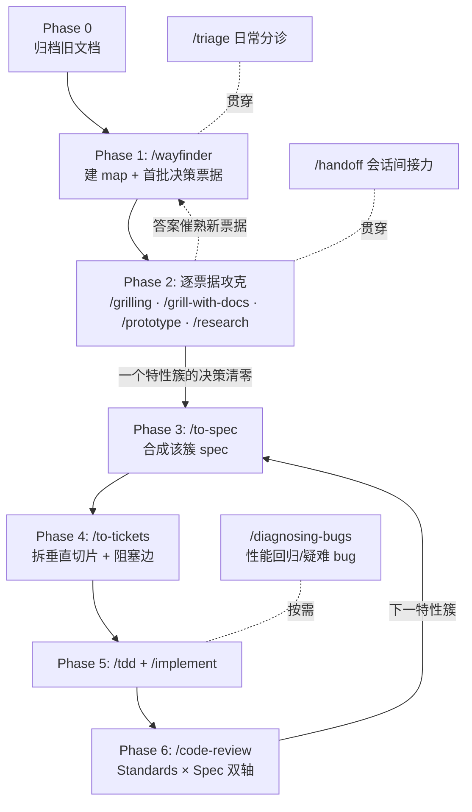

# aiduMEM 优点移植：技能调用流程设计

**日期**: 2026-08-02
**状态**: 待确认（Phase 1 的 grilling 会逐项确认或推翻本文档中的提案）
**范围**: 将 aiduMEM 的六组优点（A–F）移植进 Remembrance-System，取代旧 P2 计划

---

## 0. 背景与依据

对比分析基于对两个仓库的全量代码与文档阅读（2026-08-02）：

| 组别 | aiduMEM 的优点 | Remembrance 现状 |
|------|---------------|------------------|
| A. 写入侧节流 | 潮波合并三档策略 + fastpath 白名单直写（宁 miss 不脏写） | coalesce 未实现，每条消息一次 LLM 提取 |
| B. 全链路可观测 | `/search_trace` 全链路追踪、coalesce/stats、健康探针 | 完全没有 |
| C. 数据治理 | 衰减只降权不删行、Jaccard 三态去重（≥0.85 merge / ≥0.70 update / insert） | 遗忘是归档；无写入侧三态去重 |
| D. 集成与部署 | Shell Hook（2s 超时静默降级）、MCP server（僵尸进程清理）、manifest.json | 仅有 P2 计划文档，未落地 |
| E. 工程化体系 | Dockerfile、GH Actions 发布流、运维脚本（dry-run）、32 个环境变量零硬编码 | 全缺 |
| F. 架构纪律 | 兼容门面模式（重构只搬家不改语义）、api_server 只做组装 | api_server 偏厚，无门面约定 |

**已确认的前置决策**（2026-08-02 与用户确认）：

- 移植范围：A–F 全量
- 技术栈：逐案决定（在 wayfinder 决策票据中讨论，见票据 01）
- 旧 P2 文档（`docs/plans/p2-tidal-coalescing-mcp.md`、`.scratch/docs/reranker-spec.md`）：归档，所有决策在新 map 中重走
- 本流程只交付设计；技能由用户逐阶段调用

---

## 1. 总览：技能调用链

核心原则：**先决策，后实施**。Phase 1–2 只产出决策（wayfinder 的"plan, don't do"），决策清零的特性簇才进入 Phase 3–6 的实施流水线。所有产物落在本仓库已配置的本地 markdown issue tracker（`.scratch/`）上。

---

## 2. Phase 0：准备（一次性，约 5 分钟）

在 chart map 之前执行：

1. 归档旧文档（新流程取代旧计划，但保留历史）：
   - `docs/plans/p2-tidal-coalescing-mcp.md` → `docs/plans/archive/p2-tidal-coalescing-mcp.md`
   - `.scratch/docs/reranker-spec.md` → `docs/plans/archive/reranker-spec.md`（reranker 已实现且与代码一致，作为历史决策存档，不进新 map）
   - 在两个文件头部各加一行：`> **已归档**：2026-08-02 起由 aiduMEM 移植流程取代，见 docs/plans/aidumem-port-skill-workflow.md`
2. 确认 `AGENTS.md` + `docs/agents/*.md` 就位（✅ 2026-08-02 已由 setup-matt-pocock-skills 完成）

---

## 3. Phase 1：/wayfinder 建图（一个会话）

触发语示例：「用 wayfinder 技能，按照 docs/plans/aidumem-port-skill-workflow.md 第 3 节建图」。

### 3.1 目的地（提案，grilling 时确认）

> Remembrance-System 吸收 aiduMEM 的六组优点：写入节流、全链可观测、数据自治、可插拔集成、克隆即跑、架构有纪律——以逐案确定的技术栈落地，每个特性簇有 spec、有测试、有审查。

### 3.2 Map 文件

按本地 tracker 约定：`.scratch/aidumem-port/map.md`，含 Destination / Notes / Decisions so far / Not yet specified / Out of scope 五节。

**Notes 节建议写入**：

- 参照系代码在 `C:\Users\Asus\Desktop\aiduMEM`（只读参照，不 import、不复制 license 不兼容的代码——aiduMEM 带 LICENSE，移植的是设计思想与参数区间，代码自己写）
- 每个会话先读 `docs/agents/domain.md`、`CONTEXT.md`（若已由 /domain-modeling 创建）
- 术语遵循 `CONTEXT.md` 词汇表（lane / tier / gate / coalesce…）
- 所有决策票据遵循「技术栈逐案」原则

### 3.3 首批决策票据（16 张，建图时创建）

按 `.scratch/aidumem-port/issues/NN-<slug>.md` 编号，阻塞边在建图第二遍接线。

| # | 票据（决策问题） | 类型 | Blocked by |
|---|------------------|------|-----------|
| 01 | 基础设施栈逐案：ChromaDB 保留还是换 Qdrant？是否引入 mem0 组件？BM25 中文分词器选型（现状按空格分词对中文无效）？ | grilling | — |
| 02 | coalesce 缓冲键设计：remembrance 无 session/profile 概念，按键（user_id？user+lane？）与 default/tech/intimate 三档策略是否照搬 | grilling | — |
| 03 | coalesce 冲刷参数校准：idle 4s / window 12s / 8 条 / 2000 字在本项目消息分布下是否成立 | prototype | 02 |
| 04 | fastpath 白名单直写：哪些句型绕过 LLM 提取，「宁 miss 不脏写」的验收标准 | grilling | — |
| 05 | `/search_trace` 全链路追踪的输出结构与 overhead 上限 | prototype | — |
| 06 | 健康探针与 stats 端点范围：检查哪些依赖（LLM/embedding/Chroma/SQLite），暴露哪些计数 | grilling | — |
| 07 | 性能基线工具形态：移植 aiduMEM 的 50 问句 perf_baseline 还是自建 | research | — |
| 08 | 遗忘语义：从「归档」改为「只降权不删行」？与现有 lane profile 衰减的关系 | grilling | 01 |
| 09 | Jaccard 三态去重：0.85/0.70 阈值在中文 embedding 下是否成立（需实测） | prototype | 01 |
| 10 | Shell Hook 注入契约：stdin/stdout JSON 形状、2s 超时静默降级、超短消息不注入 | grilling | — |
| 11 | MCP server 形态：独立 stdio server / 仅 Shell Hook / 两者并存 | grilling | — |
| 12 | manifest.json 插件清单：目标宿主生态是否需要 | grilling | 11 |
| 13 | 零硬编码：`REMEMBRANCE_*` 环境变量清单、密钥文件注入（.sf_key 模式）、`__file__` 自解析仓库根 | grilling | — |
| 14 | Docker 与 GH Actions：基础镜像、tag → wheel → GHCR 发布流 | grilling | 01 |
| 15 | 运维脚本清单：升级检查 / 备份恢复 / 分层回填（默认 dry-run） | grilling | — |
| 16 | 兼容门面策略：是否确立「只搬家不改语义，旧 import 全绿」铁律；api_server 瘦身为只组装的边界 | grilling | — |

### 3.4 战争迷雾（Not yet specified，暂不入票）

- coalesce 与 `/add` 同步提取路径的关系（替换 / 并存 / 开关）——待 02、03 清晰后出票
- salience 冲突降权（反义词对碰撞）与现有 contradiction gate 的整合——待 08、09 后出票
- autodream 式 7 天周期蒸馏是否引入——待 08 后出票
- checkpoint 五段会话快照（aiduMEM `checkpoint.py`）是否移植——待 05、06 后出票

### 3.5 Out of scope（提案，建图 grilling 时确认）

- v13 联邦多 Agent（remembrance 当前单用户单实例，无此需求）
- instinct_graduation（记忆蒸馏成 skill）——与项目定位不符

建图最后一步：对类型为 research 的票据（07）立刻fire `/research` 子代理并行攻关；其余票据留给后续会话。建图本身一个会话完成，不解决任何票据。

---

## 4. Phase 2：逐票据攻克（每会话一票）

触发语示例：「用 wayfinder 技能继续推进 .scratch/aidumem-port/map.md」。

每会话协议：

1. 读 map（低分辨率视图）→ 取 frontier 上第一张未认领票据 → **先认领**（`Status: claimed`）再开工
2. 按票据类型调用技能：`grilling` → /grilling 或 /grill-with-docs（后者顺手沉淀 ADR 与术语表，推荐）；`prototype` → /prototype（一次性原型，回答完即弃）；`research` → /research 子代理
3. 关闭票据：答案写入 `## Answer`，`Status: resolved`，map 的 Decisions so far 追加一行 gist + 链接
4. 答案催熟的迷雾出票（先建票后接线）；发现某票据超出目的地则关闭并记入 Out of scope
5. **每会话最多解决一张票据**（research 票据除外）；会话收尾用 /handoff 生成交接文档

**HITL 纪律**：grilling / prototype 类票据必须与你真人对话完成，agent 不得自问自答。

---

## 5. Phase 3–6：实施流水线（按特性簇循环）

一个特性簇的决策票据全部 resolved、且 spec 所需事实齐备后，进入实施。建议的特性簇顺序（理由见下）：

理由：16 是预重构（"make the change easy, then make the easy change"），13 让后续所有特性可配置；A/B 是独立新模块、风险低见效快；C 动存量数据语义，放在有观测（B）之后便于验证；D 依赖核心链路稳定；E 的 Docker/CI 在功能定型后收尾。

每个特性簇固定走四步：

1. **/to-spec** — 触发语：「用 to-spec 技能，把 A 簇的已关闭票据合成 spec」。产物：`.scratch/aidumem-port/<feature>/spec.md`。spec 引用票据答案，不复制全文。
2. **/to-tickets** — 触发语：「用 to-tickets 技能拆 <feature> 的 spec」。拆 tracer-bullet 垂直切片（每片一个上下文窗口可完成、可独立演示），逐片确认粒度与阻塞边后，发布为 `.scratch/aidumem-port/<feature>/issues/NN-*.md`（`Status: ready-for-agent`）。注意：F 类宽重构走 expand–contract 序列，不强行垂直切。
3. **/tdd + /implement** — 逐票实施。red-green-refactor，在约定 seam 处先写测试；定期跑单测，收尾跑全量。**强制要求**：mock LLM 与 Chroma（现有测试未 mock，是本流程要根治的债）。每票提交到当前分支。
4. **/code-review** — 触发语：「用 code-review 技能审查自 <fixed-point> 以来的变更，spec 在 <path>」。Standards × Spec 双轴并行子代理审查；findings 逐条处理后再推进下一票。

---

## 6. 贯穿性技能（按需，不占主线）

| 场景 | 技能 | 说明 |
|------|------|------|
| 日常来了新 issue / 外部输入 | /triage | 按 `docs/agents/triage-labels.md` 五标签流转 |
| 移植中出现性能回归或疑难 bug | /diagnosing-bugs | 诊断循环，先复现再假设 |
| 会话上下文将尽 / 换会话接力 | /handoff | 压缩当前进度为交接文档 |
| 决策中沉淀术语与架构决策 | /domain-modeling（随 /grill-with-docs 自动带上） | 惰性创建 `CONTEXT.md` 与 `docs/adr/`——不存在时静默跳过，不提前补 |
| 16 号票据需要候选重构点 | /improve-codebase-architecture | 扫描深化机会，HTML 报告后逐个 grill |
| 拿不准该用哪个技能 | /ask-matt | 技能路由器 |

---

## 7. 完成定义（整个移植流程的验收）

- map 上所有决策票据 resolved，迷雾清零
- 六个特性簇各有 spec、实施票据、测试、code-review 记录
- `git clone` 后按 README 单命令可跑（零硬编码达成）
- `/search` 链路可观测（trace/stats/health 三端点在线）
- coalesce 上线后 LLM 提取调用次数有可量化的下降（以 07 号票据的基线工具实测对比）
- 全量测试绿，且不再依赖真实 LLM/Chroma

---

## 8. 立即可以做的第一件事

跟我说一句：「**用 wayfinder 技能建 aiduMEM 移植的 map**」——我会先归档旧文档（Phase 0），然后按第 3 节与你 grilling 确认目的地和首批票据，把 `.scratch/aidumem-port/` 建起来。
